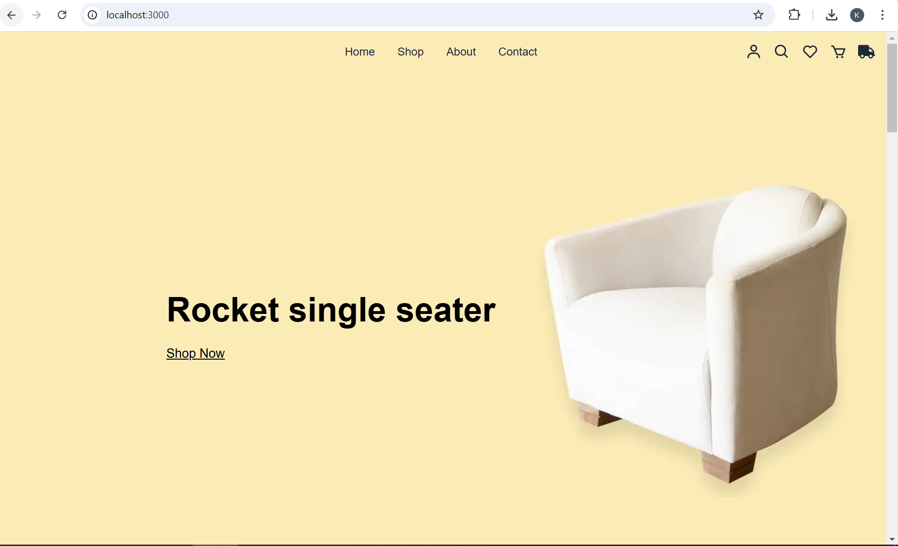
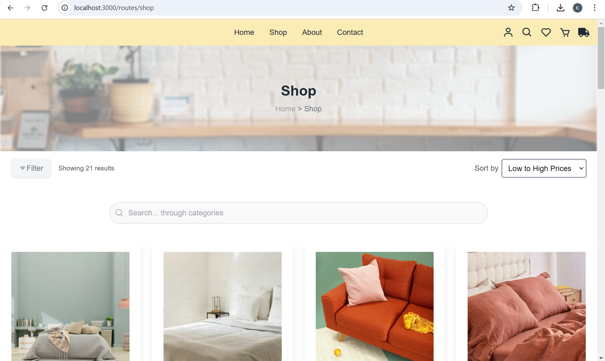
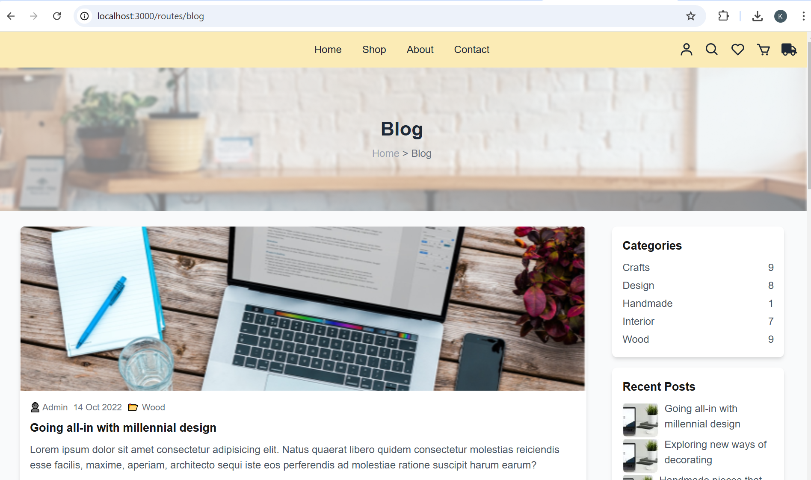
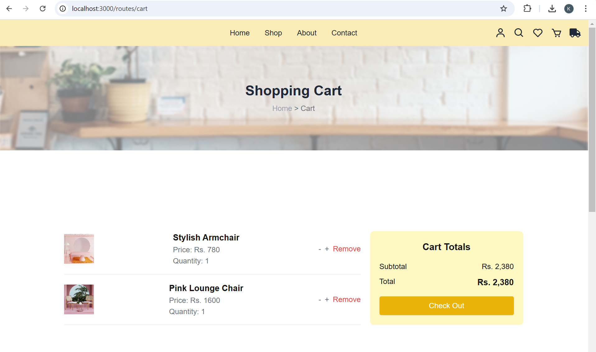
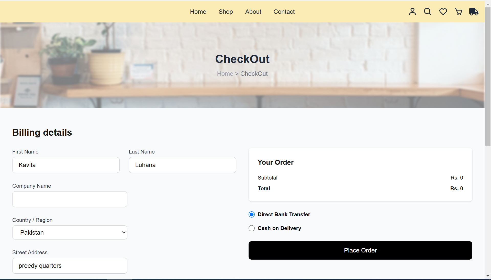
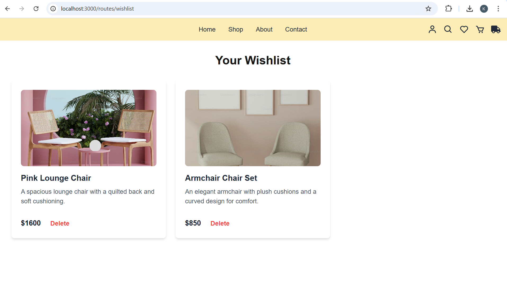
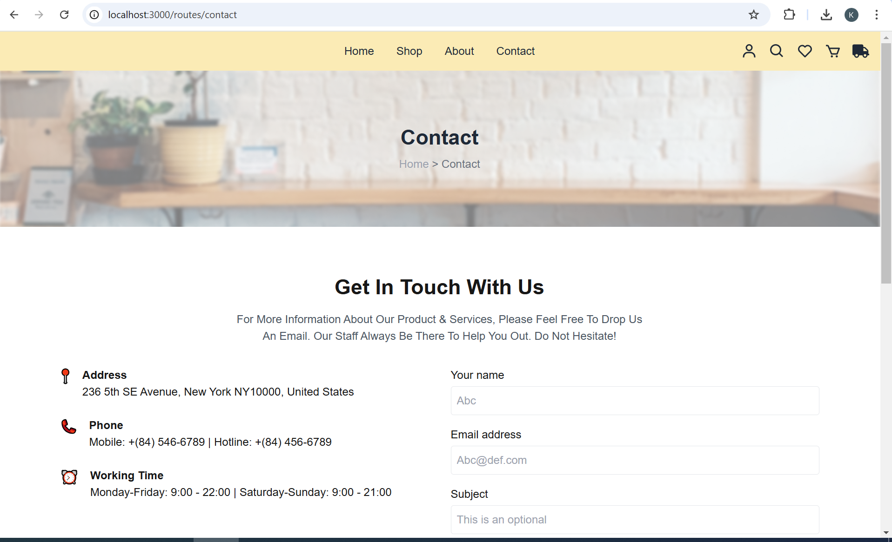
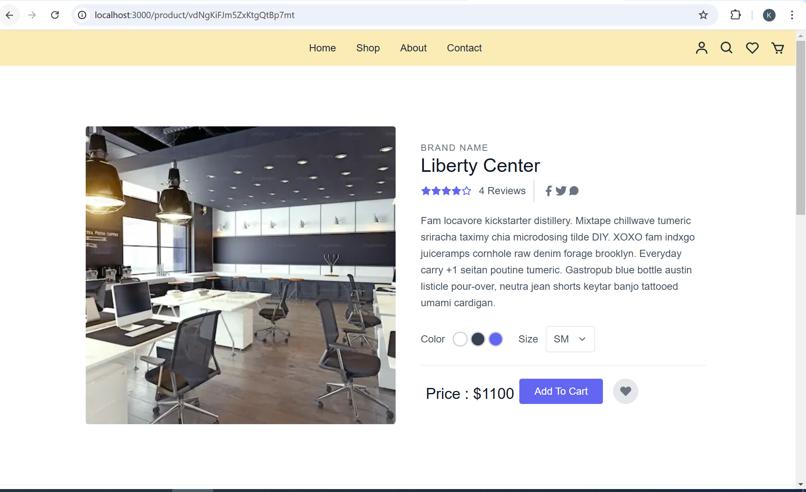
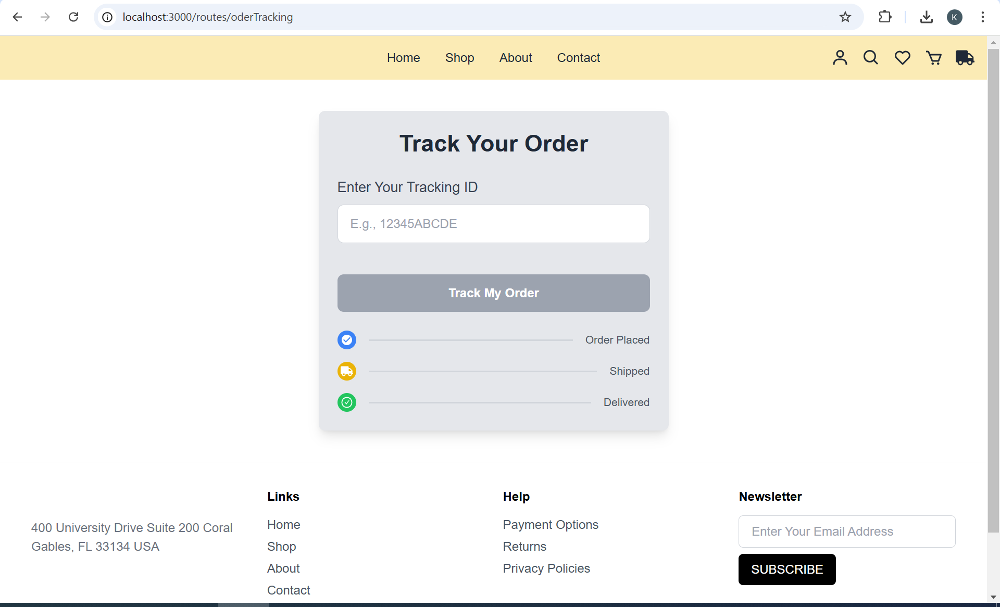

#### 🌟 Hackathon Day 4 Completed! 🌟
Hello everyone! I am kavita a Frontend Web Developer


🚀 Hackathon 3 Day 4: Template 0 Task Completed! 

I'm excited to share that I've successfully completed the Day 4 task for Template 0 in the hackathon! Here's what I achieved:

🚀 My Latest Project: A Dynamic Furniture E-commerce Website Built with Next.js! 🚀

After working hard on this project, I’m thrilled to share that I’ve created a dynamic e-commerce furniture website using Next.js, TypeScript, and Sanity CMS. It’s a complete website template that allows for dynamic content management and a smooth user experience, with all the essential features like:

🔹 Home Page: A clean, user-friendly design to showcase featured products and promotions
🔹 Shop Page: A filterable, category-based product list with dynamic content integration
🔹 Product Detail Page: Detailed product descriptions, pricing, and images
🔹 Cart & Checkout: Functional shopping cart and a smooth checkout process
🔹 Wishlist & Order Tracking: Save your favorite items and track your orders
🔹 Contact & Profile Pages: Easy communication and user management and more.

Technologies Used:
Frontend: HTML, CSS, TypeScript
Framework: Next.js
CMS: Sanity for managing dynamic content
Styling: Tailwind CSS for responsiveness
This project not only helped me strengthen my skills in Next.js, TypeScript, and Sanity CMS, but also gave me valuable experience in building a dynamic website.


# Project Title:DAY 4 - BUILDING DYNAMIC FRONTEND COMPONENTS FOR YOUR MARKETPLACE:


## Furniture Website Template with Next.js: 

This is a dynamic e-commerce furniture website template built with Next.js, TypeScript, and Sanity CMS. The template includes essential pages such as home, shop, product details, cart, checkout, wishlist, order tracking, and profile management. It also features dynamic content management through Sanity CMS and is styled using Tailwind CSS for responsiveness.

### Features: 


- Home Page: A stylish landing page displaying featured products, categories.

- Shop Page: A dynamic page displaying a variety of furniture products, categorized and filterable by price, type, and category.

- Product Detail Page: Users can view detailed information about each product with images, descriptions, and pricing.

- Cart: Allows users to add and manage items before checkout.

- Checkout Page: A functional checkout process for users to complete their purchases.

- Wishlist: Users can save products they are interested in.

- Order Tracking: Users can track their orders after purchase.

- Contact Page: A form for customers to reach out to support.

- Profile Page:  Users can manage their profile information.


## Technologies Used:

### Frontend:

- Next.js: Framework for building the application.
- HTML, CSS, and TypeScript: Core web technologies for building the structure, styles, and interactivity.
- React.js: Used to build reusable components for the user interface.
- Sanity CMS: A headless CMS for managing dynamic content such as products, categories, and orders.
- Tailwind CSS: Utility-first CSS framework for styling and building a responsive design.


## Screenshots

### Here are some screenshots of the furniture website template:
#### Short Overveiw: 
- Home Page:



- Shop Page:


- Blog Page:


- Cart Page:


- CheckOut Page: 


- WhishList Page:


- Contact Page:


- ProductDetail Page:


- OrderTracking Page:


 - Integration with Sanity CMS.
- Sorting products by price (low to high, high to low).
- Dynamic routing for individual product pages.
- Responsive design for all devices.
- Error handling for API calls.


## Acknowledgments
```
Sanity CMS: For managing dynamic content like products and categories.
Tailwind CSS: For providing a fast and efficient way to style the site.
Next.js: For building a performant and SEO-friendly application.

```
```
completed.......
```