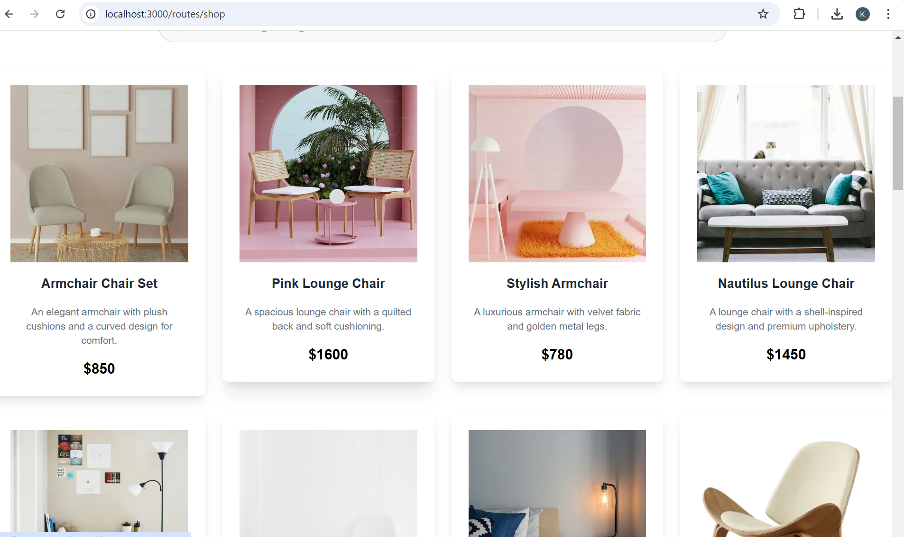
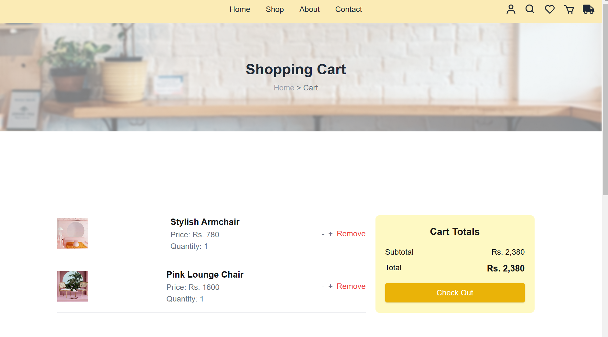
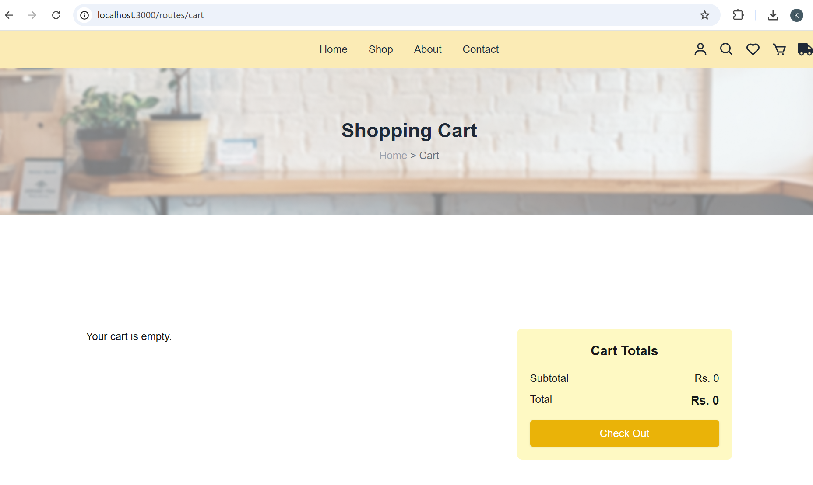
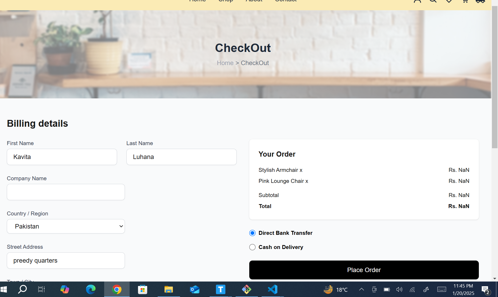
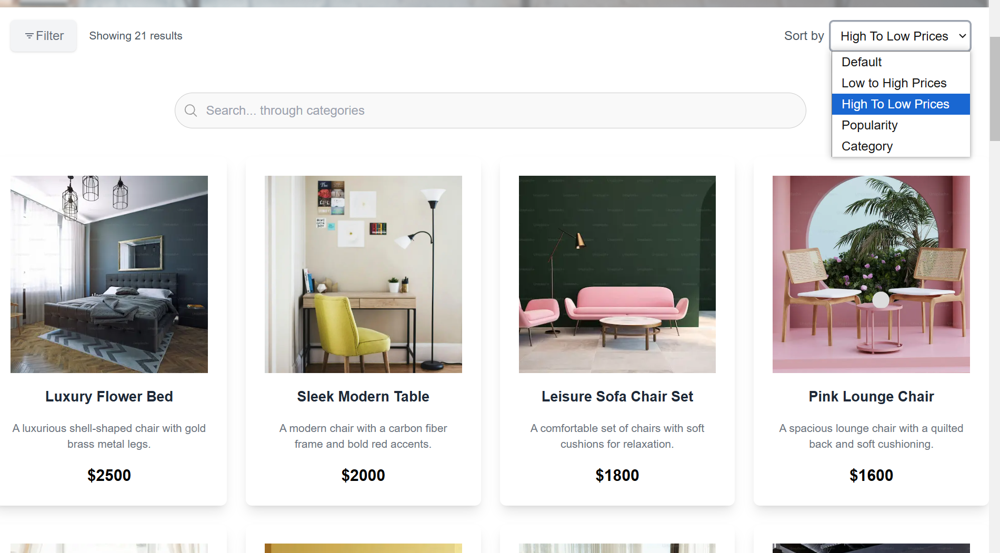
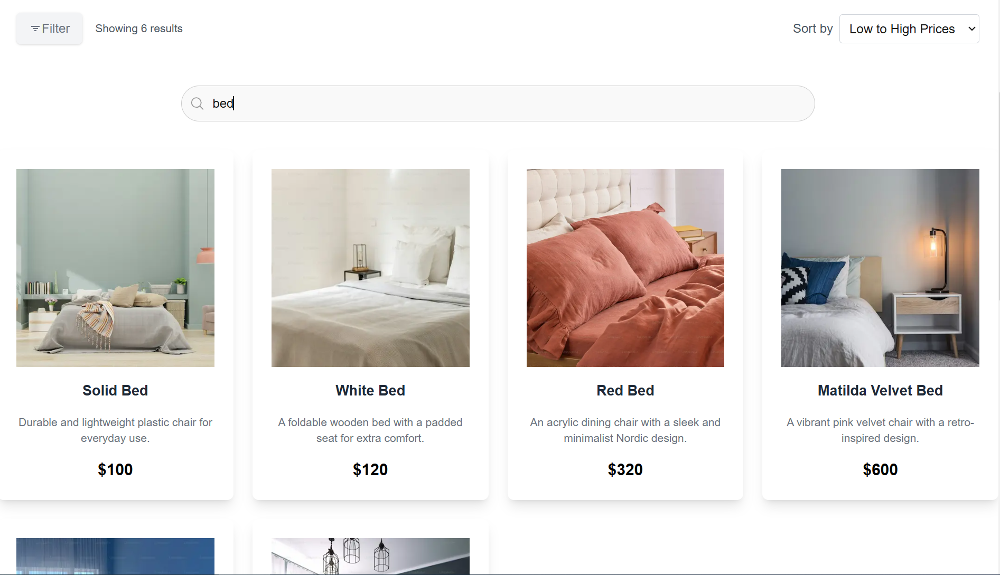
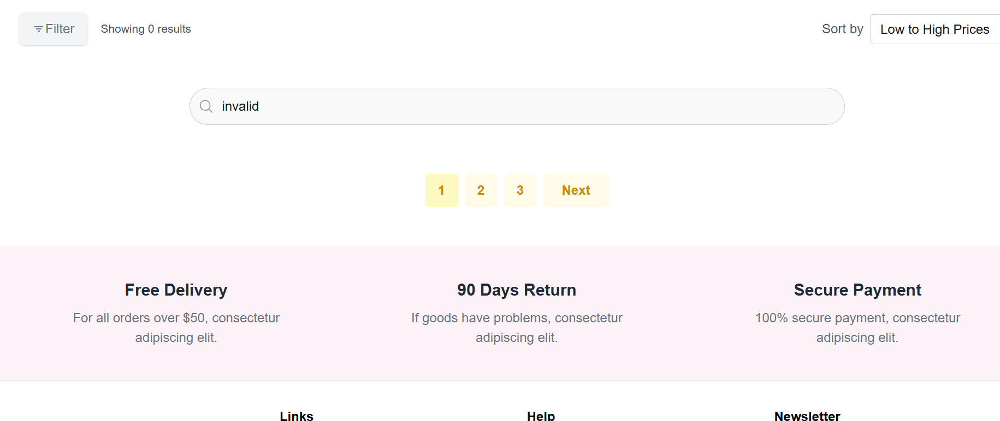
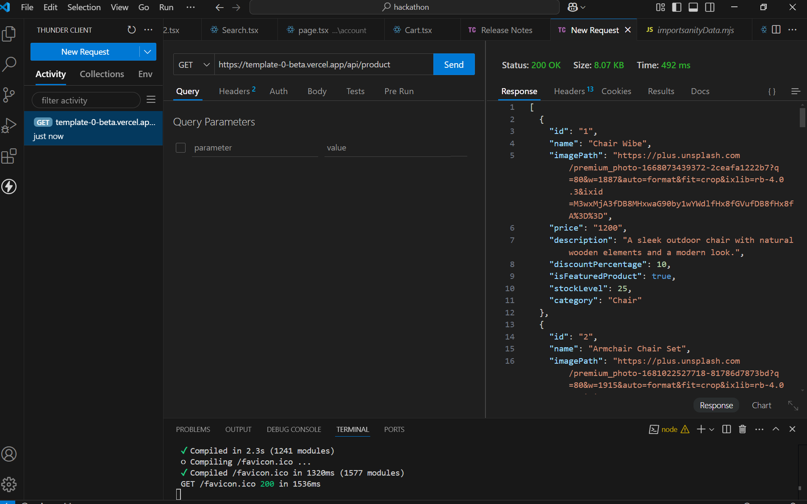
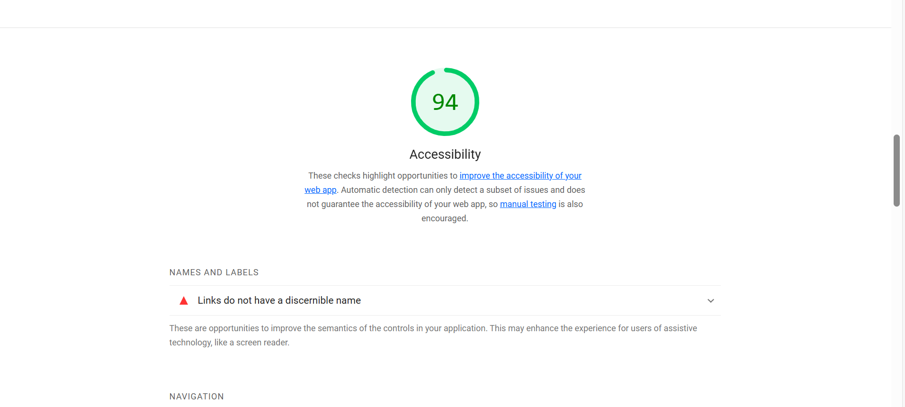
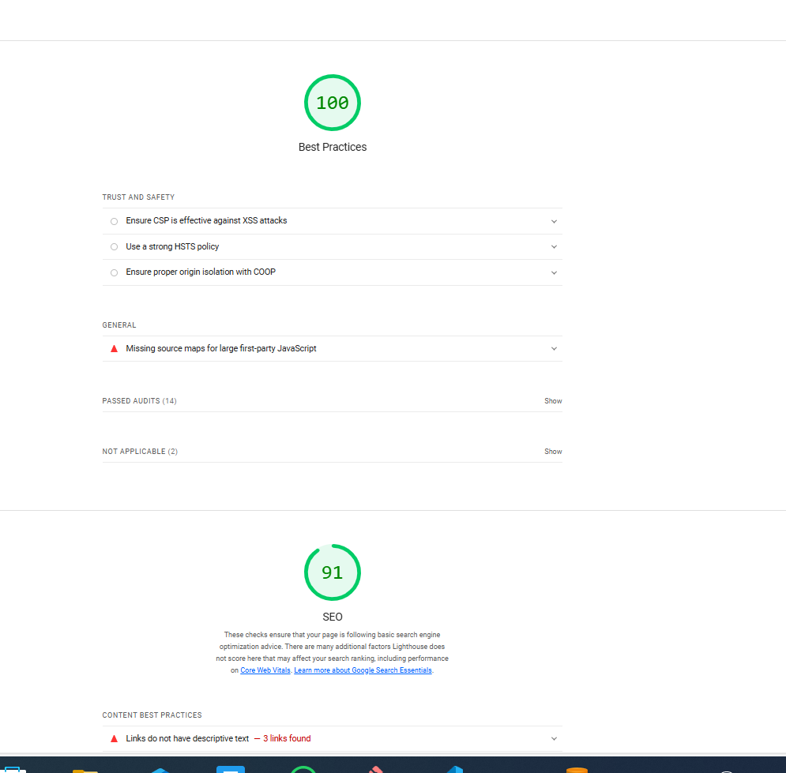

# Test Documentation for Marketplace Application


## 1. Introduction:

This document provides comprehensive testing results for the marketplace application, focusing on key functionalities such as product listing, cart functionality, API error handling, mobile responsiveness, checkout process, price sorting, and search filtering. The testing ensures that the application behaves as expected across different use cases and edge cases.


## 2. Test Objectives:

- Validate core functionalities like product listing, cart operations, checkout process, sorting, and search.
- Ensure the application is responsive on mobile devices.
- Test error handling mechanisms to ensure graceful failure.
- Verify that features are working correctly with real-time data from the backend.
- Conduct regression testing to ensure new changes don’t break existing functionality.


## Click here to access the report:


[Documentation](./Report.csv)


## 4. Detailed Test Case Results:

### Test Case TC001 - Validate Product Listing Page

- Objective: Ensure that the furniture section displays accurate product details.

#### Test Steps:
```
 1) Open the shop page.
 2) Navigate to the furniture section.
 3) Verify the product details (name, price, image).
 ```

- Expected Result: All furniture products are displayed with accurate details.

- Actual Result: Products displayed as expected.

- Status: Passed

- Severity: Low

Image:




 


### Test Case TC002 - Test API Error Handling

- Objective: Test how the application handles API disconnection.

#### Test Steps:
```
 1) Disconnect the API.
 2) Refresh the page.
 3) Verify if error messages are displayed.

 ```

- Expected Result: A fallback UI with the message "Unable to load products" should be shown.

- Actual Result: Fallback UI displayed correctly.

- Status: Passed

- Severity: Medium

Image:


### Test Case TC003 - Check Cart Functionality

- Objective: Verify that products can be added and removed from the cart correctly.

#### Test Steps:
```
 1) Add a product to the cart.
 2) View the cart.
 3) Remove a product from the cart.
 4) Verify the cart updates accordingly.

 ```

- Expected Result: The cart should update with added and removed products.

- Actual Result: Cart updated as expected.

- Status: Passed

- Severity: High

Image:





### Test Case TC004 - Ensure Responsiveness on Mobile

- Objective: Ensure that the application adjusts correctly on mobile devices.

#### Test Steps:
```
 1) Resize the browser window.
 2) Test the layout on mobile view.
 3) Verify that the layout is responsive and adjusts correctly.


 ```

- Expected Result: The layout should adapt and display correctly on smaller screens.

- Actual Result: Responsive layout functioning as intended.

- Status: Passed

- Severity: Medium

Image:


### Test Case TC005 - est Checkout Process

- Objective: Verify the checkout process from cart to payment confirmation.

#### Test Steps:
```
 1) Add items to the cart.
 2) Proceed to checkout.
 3) Complete the payment process.
 4) Verify the successful checkout with a confirmation message.


 ```

- Expected Result: Checkout should complete successfully, with a confirmation message displayed.

- Actual Result: Checkout process completed successfully.

- Status: Passed

- Severity: High

Image:





### Test Case TC006 - Validate Price Sorting Functionality (High to Low)

- Objective: Ensure that the products can be sorted by price in descending order.

#### Test Steps:
```
 1) Go to the product listing page.
 2)Select "Price: High to Low" option.
 3) Verify that products are displayed in descending order of price.


 ```

- Expected Result: Products should be sorted in descending order by price.

- Actual Result: Sorting functionality works as expected.

- Status: Passed

- Severity: Medium

Image:




### Test Case TC007 - Validate Price Sorting Functionality (Low to High)

- Objective: Ensure that the products can be sorted by price in ascending order.

#### Test Steps:
```
 1) Go to the product listing page.
 2)Select "Price: Low to High" option.
 3) Verify that products are displayed in ascending order of price.


 ```

- Expected Result: Products should be sorted in ascending order by price.

- Actual Result: Sorting functionality works as expected.

- Status: Passed

- Severity: Medium

Image:


### Test Case TC008 - Validate Search Functionality by Categories

- Objective: Ensure that products can be filtered correctly by category using the search bar.

#### Test Steps:
```
 1) Enter a category name in the search bar.
 2) Press Enter to apply the filter.
 3) Verify that products are filtered by the specified category.


 ```

- Expected Result: Products should be filtered based on the entered category.

- Actual Result: Search filter applied correctly.

- Status: Passed

- Severity: High

Image:




### Test Case TC009 - Validate Search Functionality with Invalid Categories

- Objective: Test how the search handles non-existent categories.

#### Test Steps:
```
 1) Enter a non-existent category name in the search bar.
 2) Press Enter to apply the filter.
 3) Verify if a message such as "No products found" is displayed.


 ```

- Expected Result: A fallback message "No products found" should be displayed.

- Actual Result: Fallback UI displayed correctly with the message "No products found."

- Status: Passed

- Severity: Low 

Image:




## 5. Results Summary:
- Total Test Cases Executed: 9
- Passed Test Cases: 9
- Failed Test Cases: 0

All test cases were executed successfully, and the application meets the expected behavior across all test scenarios.

## Here is products api status


### here is my website SEO:





### 6. Conclusion: 
The marketplace application has passed all tests with no issues reported. The functionalities such as product listing, cart functionality, sorting, and search are working as expected. The application also handles errors gracefully with fallback messages, and is responsive on mobile devices.


