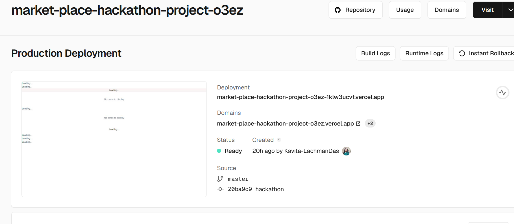

### Summary of Activities: Days 1 to 6

# Day 1: Project Initiation and Planning 

### Goal:
- Establish the project objectives and scope.
- Configure the foundational structure for the marketplace app.

### Major Tasks:

- Created a GitHub repository with a well-organized folder structure (src/, public/, etc.).
- Installed essential tools and frameworks, including React and Next.js.
- Planned milestones and deliverables for the project.

### Outcome:
- The project was set up with a professional structure.
- A clear development roadmap was established.

# Day 2: Core Development (Frontend and Backend)

### Goal:
- Develop the primary functionality for the frontend and backend.

### Major Tasks:
- Designed UI components, such as product listings, search functionality, and a shopping cart.
- Established a backend server with APIs for handling user and product data.
- Integrated the frontend with the backend using RESTful APIs.

### Outcome:

- A functional marketplace prototype was developed, incorporating essential features.

# Day 3: Database and Feature Improvements
### Goal:
- Connect the application to a database and enhance functionality.
### Major Tasks:

- Integrated a database (e.g., MongoDB or Firebase) for managing user and product data.
- Implemented features such as user authentication and advanced product filtering.
- Refined the user interface for a smoother experience.
### Outcome:

- The database was successfully integrated with full CRUD functionality.
- User experience enhancements were implemented alongside new features.

# Day 4: Testing and Bug Fixing
### Goal:

- Conduct thorough testing to ensure a stable application.
### Major Tasks:

- Performed unit tests for individual components.
- Conducted integration testing to verify interactions between different modules.
- Documented testing results and cases in a structured format (e.g., CSV).
### Outcome:

- A stable, bug-free application was achieved.
- Comprehensive testing documentation was prepared.

# Day 5: Optimization and Pre-Deployment Testing
### Goal:

- Optimize application performance and finalize testing before deployment.
### Major Tasks:

- Used performance testing tools like Lighthouse to identify areas for improvement.
- Optimized API interactions to minimize response times.
- Implemented security measures, such as input validation and secure API key management.
### Outcome:

- Performance optimizations were successfully implemented.
- The application was deemed ready for deployment.
# Day 6: Staging and Deployment
### Goal:

- Prepare and deploy the application in a staging environment.
### Major Tasks:

- Selected Vercel as the hosting platform and connected the GitHub repository.
- Configured environment variables securely via .env files.
- Deployed the application to a staging environment and verified functionality.
- Conducted comprehensive testing, including functional, performance, and security tests.
- Documented results, performance metrics, and unresolved issues.
### Outcome:

- The application was deployed successfully in a staging environment.
- Detailed documentation, including deployment instructions and test results, was completed.

##  Comprehensive Test Case Report

[Report Link](https://lnkd.in/gbxtUAya)

### Deployment Instructions

### 1) Hosting Setup:

- Use platforms like Vercel or Netlify for reliable deployment.
- Connect the hosting platform to your GitHub repository.
- Configure build and deployment settings appropriately.
### 2) Environment Variables:

- Store sensitive data (e.g., API keys) in a .env file.
- Securely upload environment variables to the hosting platform.
### 3) Staging Deployment:

- Ensure the build completes successfully without errors.
- Validate all application functionality in the staging environment.

### 4) Testing:

- Conduct functional, performance, and security tests in the staging environment.
- Record all issues, resolutions, and test results.
### 5) Documentation:

- Structure all files in a well-organized GitHub repository.
- Include a professional README.md summarizing the project details.

## GitHub Repository Structure

- src/ - Source code files.
- public/ - Static assets.
- documents/ - Reports, test cases, and deployment documentation.
- README.md - Project overview, deployment steps, and outcomes.

## Final Deliverables

### 1) Link to the deployed staging environment.
### 2) Organized GitHub repository containing:
- Test reports and performance metrics.
- Deployment instructions.
- Structured project files.
### 3) Comprehensive README.md summarizing the project.
Links:

GitHub Repository: [https://lnkd.in/gj6UPCNa]
Staging Environment: [https://lnkd.in/g4hky_Ag]

## 🔗 Links

