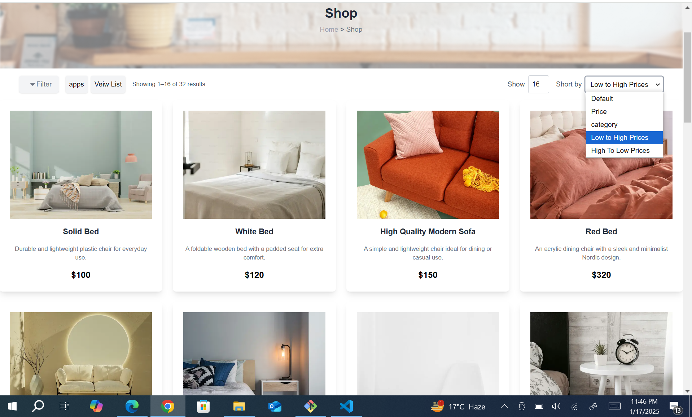
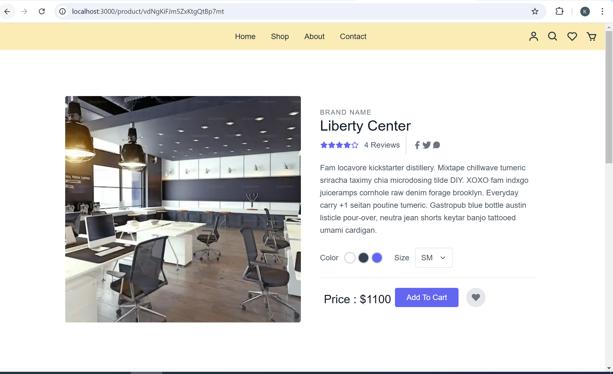

#### 🌟 Hackathon Day 3 Completed! 🌟
Hello everyone! I am kavita a Frontend Web Developer


🚀 Hackathon Day 3: Template 0 Task Completed! 🚀

I'm excited to share that I've successfully completed the Day 3 task for Template 0 in the hackathon! Here's what I achieved:
✅ API Integration: Integrated and displayed data dynamically using Sanity CMS for Template 0.
✅ Dynamic Routing: Implemented seamless navigation to individual product pages with dynamic content.
✅ Sorting Functionality: Added sorting by price (Low to High & High to Low) for a better user experience.
✅ Responsive Design: Ensured the layout is clean and user-friendly across all devices.

This task allowed me to sharpen my skills in:
🔗 API Integration and Migration
🔗 Frontend Development with Next.js
🔗 Schema Validation and Error Handling


Grateful for the opportunity to work on Template 0 and learn more about integrating headless CMS and dynamic routing in real-world scenarios. On to the next milestone! 🎉

#Hackathon2025 #Template0 #SanityCMS #Nextjs #WebDevelopment #DeveloperJourney


# Project Title: E-Commerce Marketplace with Sanity CMS and API Integration:
```
  1) Introduction
  2) Features
  3) Technologies Used
  4) Setup Instructions
  5) API Integration
  6) Dynamic Routing
  7) Sorting Functionality
  8) Screenshots
  9) Best Practices Followed

```


## Introduction
This project demonstrates the integration of APIs with Sanity CMS to build a dynamic e-commerce marketplace. Products are fetched from the CMS and displayed on the frontend with dynamic routing for detail pages. Sorting functionality is included to display products based on price (low to high or high to low).


## Features

- Dynamic product listings.
 - Integration with Sanity CMS.
- Sorting products by price (low to high, high to low).
- Dynamic routing for individual product pages.
- Responsive design for all devices.
- Error handling for API calls.


## Technologies Used
```
- Frontend: Next.js, Tailwind CSS
- Backend: Sanity CMS, REST APIs

```
## Setup Instructions
### 1) Clone the repository:
```
git clone https://github.com/yourusername/projectname.git

```

### 2) Install dependencies:

```

npm install

```


### 3) Add environment variables:
- Create a .env.local file.
- Add the following keys:

```
NEXT_PUBLIC_SANITY_PROJECT_ID=your_project_id
NEXT_PUBLIC_SANITY_DATASET=production
SANITY_API_TOKEN=your_api_token

```


### 4) Start the development server

```
npm run dev


```

## API Integration
- here is my templete 0 API URL

```
https://template-0-beta.vercel.app/api/product

```
- Sanity CMS: All product data is fetched from Sanity.

#### Endpoints:
     - /api/products: Fetch all products.


 #### Error Handling:
- Logs API errors for debugging.
 - Displays fallback UI on errors.    


## Dynamic Routing

Each product is linked to a detail page using dynamic routing. When a user clicks on a product, they are taken to /product/[id] with dynamically rendered data.


## Sorting Functionality

- Low to High Price: Products are sorted in ascending order of their prices.


- High to Low Price: Products are sorted in descending order of their prices


### Screenshots

####  ShopPage
- Displays product listings with sorting options.



#### Product Detail Page:
- Shows detailed information for a specific product.





## Best Practices Followed: 


```
Sensitive data stored in .env.local.
Modular and reusable code.
Thorough error handling.
Consistent commit messages and version control.

```

```
completed.......
```